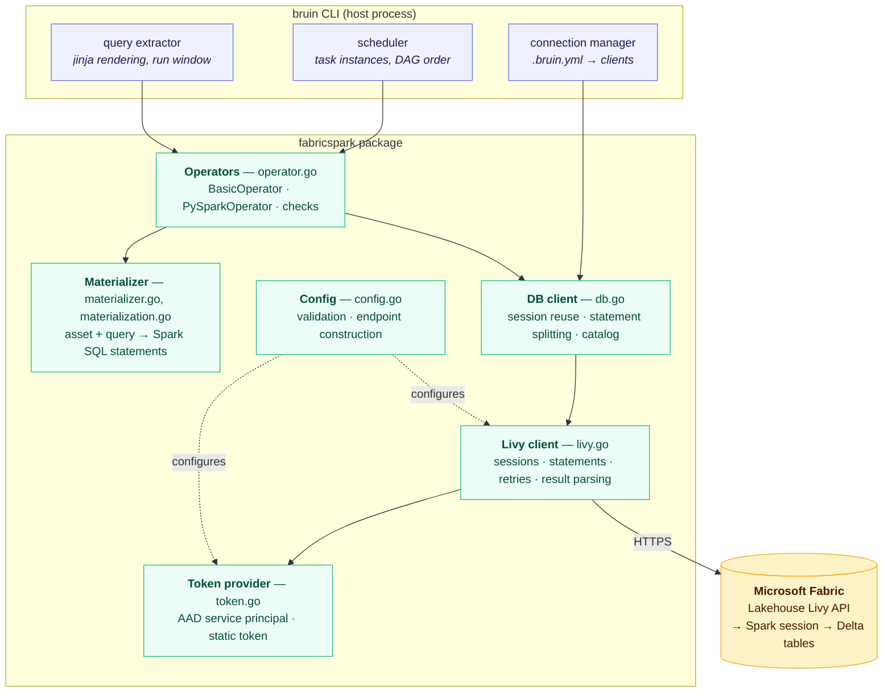
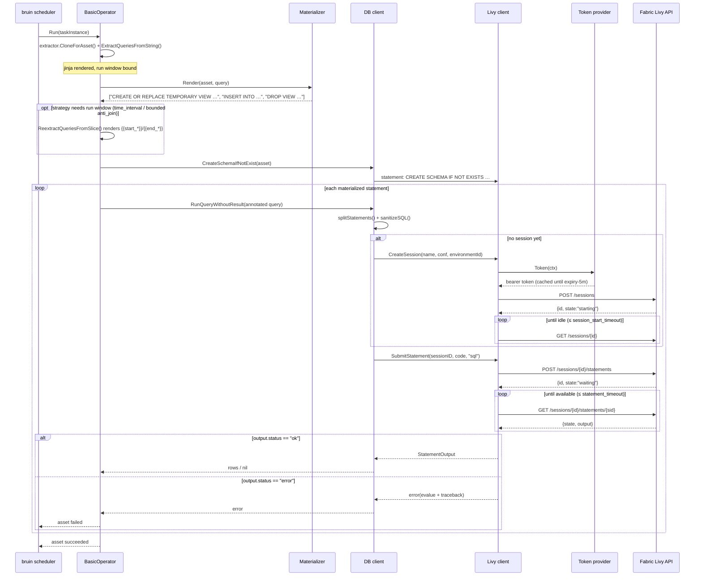
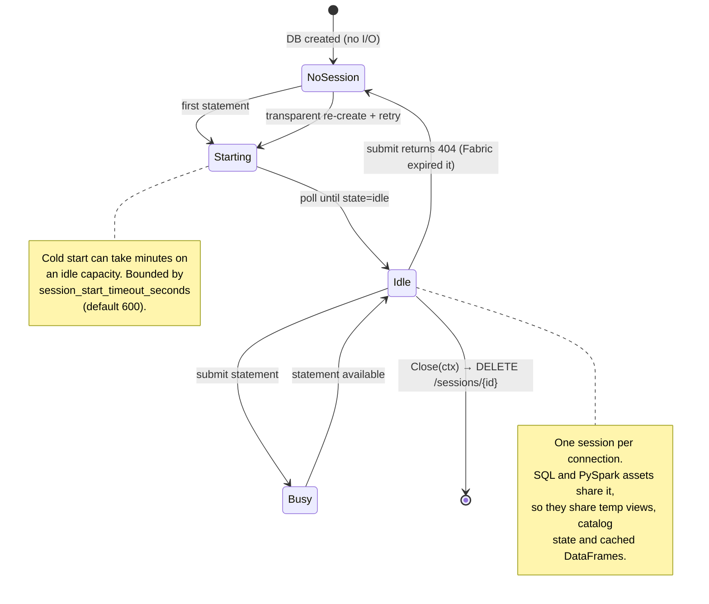
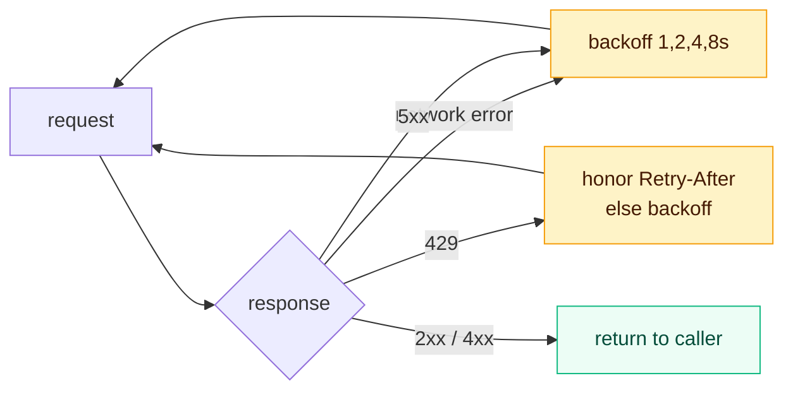
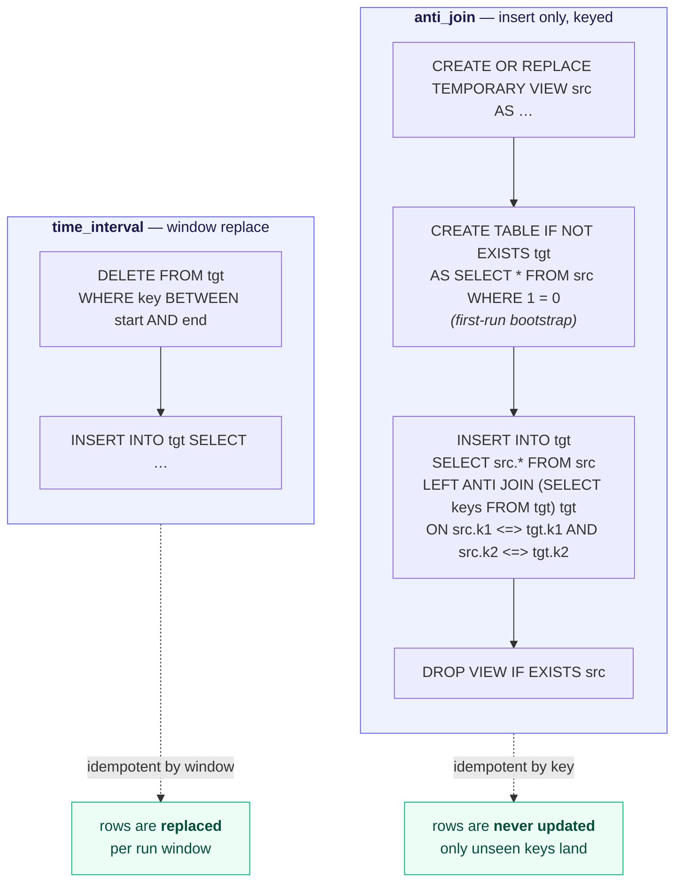
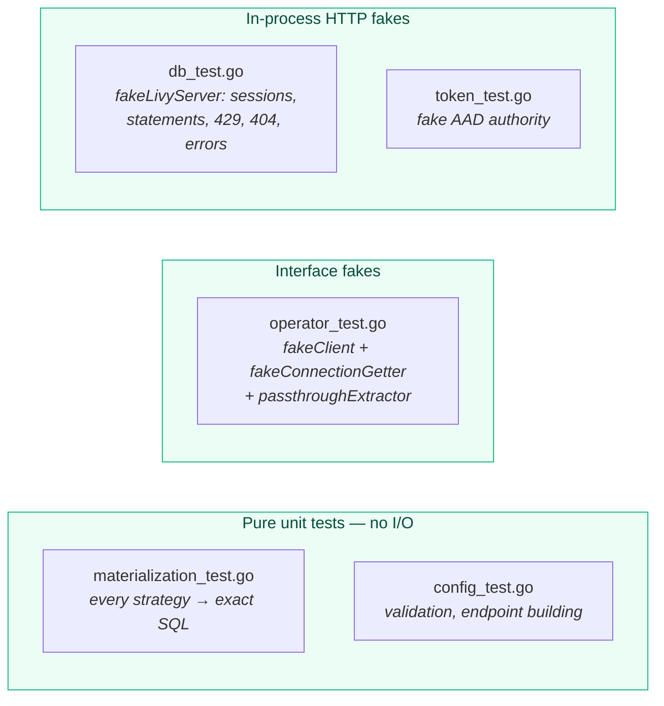

# Design: Bruin ↔ Microsoft Fabric Lakehouse (Spark) connector

This document explains how the connector is put together, why it is built
this way, and what the trade-offs are. For usage and configuration see the
[README](../README.md); for wiring it into the bruin CLI see
[INTEGRATION.md](INTEGRATION.md).

## 1. Context and motivation

Bruin executes data assets against "platforms" — Snowflake, BigQuery,
Databricks, Athena, and so on. Each platform is a Go package under `pkg/`
that implements a small set of interfaces: run a query, materialize an asset,
run a quality check.

Bruin already ships a `fabric` package, but it targets **Fabric Warehouse**
through the SQL (TDS) endpoint: it opens a `go-mssqldb` connection and speaks
T-SQL. That is the right model for a Warehouse, but it is the wrong engine for
a **Lakehouse**, where the native compute is Spark over Delta tables. Through
the TDS endpoint a Lakehouse is effectively read-only, there is no PySpark,
and the SQL dialect is T-SQL rather than Spark SQL.

This connector fills that gap. The design reference is Microsoft's
[dbt-fabricspark](https://github.com/microsoft/dbt-fabricspark) adapter, which
solves the same problem for dbt by driving the **Fabric Lakehouse Livy API**.
Livy is a REST front-end to a Spark session: you create a session, submit
statements of a given `kind` (`sql` or `pyspark`), and poll for results. That
gives us real Spark SQL, real Delta materializations, and PySpark — over plain
HTTPS, with no JDBC/ODBC driver and no Spark runtime on the client.

### Why not reuse the existing `fabric` package?

| | `fabric` (existing) | `fabricspark` (this connector) |
|---|---|---|
| Target | Fabric Warehouse | Fabric Lakehouse |
| Transport | TDS / `go-mssqldb` | Livy REST over HTTPS |
| Dialect | T-SQL | Spark SQL |
| Storage | Warehouse tables | Delta tables in OneLake |
| Python | ✗ | ✅ PySpark assets |
| Identifier quoting | `[brackets]` | `` `backticks` `` |

The two share almost no code paths below the bruin interfaces, so they are
separate packages — exactly how bruin already separates `athena`, `databricks`
and `emr_serverless` despite all three being Spark-adjacent.

## 2. Architecture

### 2.1 Layers

The package is four layers deep. Each layer knows only about the one below it,
which is what makes the whole thing testable without a Fabric capacity.

**Layer responsibilities**

| Layer | File(s) | Responsibility | Knows about |
|---|---|---|---|
| Operators | `operator.go`, `checks.go` | Implement bruin's execution interfaces; orchestrate extract → materialize → execute | bruin types, Materializer, `Client` interface |
| Materializer | `materializer.go`, `materialization.go` | Pure function: asset + query → statements. No I/O | bruin `pipeline` types only |
| DB client | `db.go` | Session lifecycle, statement splitting, result shaping, catalog introspection | Livy client |
| Livy client | `livy.go` | HTTP, retries, polling, JSON decoding | Token provider, `net/http` |
| Auth / Config | `token.go`, `config.go` | Credentials, endpoint URLs, validation | Nothing (leaf) |

The Materializer being a **pure function with no I/O** is the single most
useful property in the package: every SQL-generation rule is unit-testable by
comparing strings, with no server, no mocks and no fixtures.

### 2.2 Request path for one asset

### 2.3 Session model

A Livy session **is** a running Spark application, so how sessions are managed
directly determines both cost and semantics.

Three consequences follow from "one session per connection":

1. **SQL and PySpark share state.** A temp view created by a SQL asset is
   visible to a PySpark asset in the same run, and vice versa. This is the
   main reason PySpark is a first-class asset type rather than a separate
   submission mechanism.
2. **Statements serialize — unless high-concurrency mode is on.** In the
   default mode `db.mu` is held for the whole submit-and-poll cycle, so
   parallel assets on one connection queue rather than running concurrently
   in Spark, matching how bruin's other warehouse connections behave. With
   `high_concurrency: true` the connection instead pools REPLs from Fabric's
   `/highConcurrencySessions` API and parallel assets execute concurrently
   inside one shared Spark application — see §7.
3. **Cold start is paid once per run**, not per asset — which is why lazy
   creation matters: constructing a `DB` performs no I/O at all, so
   configuring a Fabric connection you never use costs nothing.

## 3. Component rundown

### 3.1 Config (`config.go`)

Holds identity (workspace/lakehouse GUIDs, lakehouse name), credentials,
session options, and timeouts. Two jobs:

- **`Validate()`** — fails fast and specifically: GUID-shaped IDs are
  regex-checked, a credential must be present in one of the two supported
  forms, and the endpoint must be HTTPS. Bad config produces an error at
  connection-construction time, not a confusing 401 twenty minutes into a run.
- **`LivyEndpoint()`** — builds
  `{endpoint}/workspaces/{ws}/lakehouses/{lh}/livyapi/versions/2023-12-01`.
  The API version is pinned as a constant, matching dbt-fabricspark.

### 3.2 Token provider (`token.go`)

A two-implementation interface behind `TokenProvider`:

- **`staticTokenProvider`** — returns a configured token verbatim. This is the
  local-development path (`az account get-access-token`).
- **`servicePrincipalTokenProvider`** — Azure AD client-credentials flow
  against `login.microsoftonline.com`, with the token cached under a mutex and
  refreshed 5 minutes before expiry. This is the CI path.

The scope is `https://analysis.windows.net/powerbi/api/.default` — the Power
BI scope, not a Fabric-specific one, which is a non-obvious detail inherited
from dbt-fabricspark and the source of most first-time 401s.

The `authorityBase` field exists so tests can point the flow at an
`httptest` server; it is not user-configurable.

### 3.3 Livy client (`livy.go`)

The only layer that touches the network. Everything defensive lives here.

**`doRequest` — the retry envelope.** Every call goes through one function
that acquires a token, issues the request, and retries up to 5 times with
exponential backoff on the three transient classes:

Note that 4xx responses are **returned, not retried** — they are decisions for
the caller. That distinction is what lets `runStatement` treat a 404 on submit
as "session expired, rebuild it" rather than a hard failure.

**Polling with adaptive backoff.** Session start polls every 2s ramping to
10s; statement polls start at `poll_interval_millis` (default 500ms) ramping
to 3s. Fast statements stay responsive; long ones stop hammering the API.

**Fabric's quirks, encoded.** Three behaviours are handled that only show up
against a real capacity, all learned from dbt-fabricspark:

- Session IDs come back sometimes as JSON numbers, sometimes as strings —
  hence `json.Number` and `IDString()`.
- A statement can 404 transiently right after submit, before the server
  registers it. Tolerated up to 20 polls.
- Block comments (`/* … */`) break the server-side SQL interpreter because
  statements are interpolated into a code block. `sanitizeSQL` strips them
  before submission.

**Result shape.** A finished statement carries
`output.data["application/json"]` containing `{schema: {fields}, data: [[…]]}`.
There is no server-side cursor — the entire result set arrives in one JSON
response. Column types are `json.RawMessage` because Spark encodes primitives
as strings (`"long"`) but complex types as objects; `TypeName()` handles both.

One subtlety worth calling out: a **failed** statement usually reports
`state: "available"` with `output.status: "error"`, not `state: "error"`. Both
paths are checked, otherwise failures would silently read as empty results.

### 3.4 DB client (`db.go`)

The bruin-facing connection object. Implements `Select`, `SelectWithSchema`,
`RunQueryWithoutResult`, `Ping`, `CreateSchemaIfNotExist`, `RunPySpark`, and
the catalog helpers (`GetDatabases`/`GetTables`/`GetColumns`).

Two pieces of real logic beyond delegation:

**Session reuse with transparent recovery** (`runStatement`): lazily create,
submit, and if the submit returns 404, drop the cached session, create a new
one and retry exactly once. Fabric expires idle sessions on its own schedule,
so without this a long pipeline with a slow asset in the middle would fail
arbitrarily.

**`splitStatements`** — a small hand-written scanner that splits on semicolons
while respecting single quotes, double quotes, backticks and `--` line
comments. Needed because materializers emit multi-statement SQL but Livy
accepts one statement per submission. A naive `strings.Split(sql, ";")` would
corrupt any query containing a semicolon in a string literal — which the test
suite pins with `DELETE FROM t WHERE x = ';not a boundary;'`.

### 3.5 Materializer (`materializer.go`, `materialization.go`)

A lookup table from `(materialization type, strategy)` to a builder function,
plus the `--full-refresh` override that rewrites any table strategy to
`create+replace` (except `ddl`, which is deliberately never destructive).

Every builder is `func(*pipeline.Asset, string) ([]string, error)` — no I/O,
no context, no client. Spark-specific choices worth noting:

- **`create+replace` is a single atomic statement.** Delta supports
  `CREATE OR REPLACE TABLE … AS`, so unlike the Databricks connector there is
  no temp-table/rename dance. Table history is preserved.
- **`truncate+insert` uses `DELETE FROM`, not `TRUNCATE`.** Works on every
  Delta table regardless of Fabric runtime version, same effect.
- **`ddl` emits no `PRIMARY KEY`.** Spark SQL has no such constraint; primary
  keys stay metadata that drives `merge`/`anti_join` and the checks.
- **`partition_by` and `cluster_by` are mutually exclusive** — Hive-style
  partitioning and Delta liquid clustering cannot both apply. Rejected at
  render time with a clear message rather than failing in Spark.
- **SCD2 runs as a single MERGE** (ported from bruin's Databricks connector,
  whose SQL dialect matches Spark's): changed and vanished current rows get
  closed (`_valid_until`, `_is_current = FALSE`) and new versions inserted in
  one statement. The `WHEN NOT MATCHED BY SOURCE` clause it relies on needs
  Fabric runtime 1.3+ (Delta 3.x). `--full-refresh` rebuilds the table with
  the bookkeeping columns intact rather than as a plain table.

#### The two incremental strategies

The connector supports two orthogonal incremental models, which compose:

`time_interval` is the classic datetime-window pattern: the run's window is
deleted and rewritten, so re-running a window is idempotent and corrections
flow through.

`anti_join` is the compound-business-key pattern: rows whose key already
exists are simply not inserted. Three design decisions:

1. **Null-safe equality (`<=>`).** With plain `=`, a NULL in any key column
   makes the join condition NULL, the anti join finds no match, and the row is
   re-inserted on *every* run. Null-safe equality makes NULL-bearing keys
   dedupe correctly.
2. **The target side projects only key columns.** Spark reads far less of the
   Delta table, and the join stays a keys-only shuffle.
3. **Optional window bounding.** Setting `incremental_key` +
   `time_granularity` restricts the target-side scan to the run window. On a
   large table this is the difference between scanning history and scanning a
   day. The trade-off is explicit and documented: deduplication is then only
   guaranteed *within* the window, so late-arriving cross-window duplicates
   need the unbounded form.

Because the bounded form emits `{{start_*}}`/`{{end_*}}` placeholders, the
operator must send those statements back through bruin's extractor — the same
re-extraction `time_interval` needs. The operator computes this as
`strategy == time_interval || (strategy == anti_join && incremental_key != "")`
rather than hardcoding a single strategy.

### 3.6 Operators (`operator.go`) and checks (`checks.go`)

`BasicOperator` is the SQL path and follows the shape bruin's other SQL
connectors use: clone the extractor for the asset, extract queries, reject
materialization on multi-query files, warn on `--full-refresh` + `ddl`,
materialize, optionally re-extract the run window, create the schema, then
execute each statement with a `-- @bruin.config` annotation comment attached
for traceability.

`PySparkOperator` is deliberately thin: the asset file's content is submitted
as a `pyspark` statement and any stdout is forwarded to bruin's printer. It
does **not** package the project directory or upload dependencies (contrast
`emr_serverless`, which zips the pipeline). Fabric already provides `spark`
and `sc`, the lakehouse is the default catalog, and libraries come from the
Fabric Environment referenced by `environment_id` — so the simple thing is
also the correct thing here.

Checks reuse bruin's `ansisql` implementations wherever the SQL is portable,
and override the two that are not: `accepted_values` (needs
`CAST(col AS STRING)`) and `pattern` (Spark uses `RLIKE`, not `~` or
`REGEXP_LIKE`).

## 4. Key design decisions

| Decision | Rationale | Trade-off accepted |
|---|---|---|
| Livy REST rather than JDBC/ODBC | No driver, no Spark client runtime; the only interface Fabric Lakehouse exposes for external Spark submission | Polling latency; results fully materialized in memory |
| One session per connection (default) | Shared catalog/temp-view state between SQL and PySpark; cold start paid once | Statements serialize; opt into `high_concurrency` for parallel REPLs |
| Lazy session creation | Configuring an unused connection costs nothing; `NewDB` never does I/O | First statement of a run absorbs the cold start |
| Materializers as pure functions | Every SQL rule unit-testable without a server | None material |
| Standalone Go module | Builds and tests against real bruin interfaces today, without forking bruin | Must be copied into `pkg/` for upstream; bruin version pinned |
| `anti_join` as a connector-specific strategy | The insert-only compound-key pattern has no bruin equivalent | Needs a one-line addition to bruin's lint allowlist upstream |
| Refuse incremental SCD2 | A subtly wrong SCD2 corrupts history silently | Users needing SCD2 must full-refresh or use `merge` |

## 5. Failure handling

| Failure | Where handled | Behaviour |
|---|---|---|
| Expired AAD token | `token.go` | Refreshed 5 min before expiry, under a mutex |
| Network error / 5xx | `livy.go` `doRequest` | Up to 5 attempts, exponential backoff |
| HTTP 429 | `livy.go` `doRequest` | Honors `Retry-After`, else exponential backoff |
| Session expired (404 on submit) | `db.go` `runStatement` | Session dropped, recreated, statement retried once |
| Statement 404 right after submit | `livy.go` `WaitForStatement` | Tolerated up to 20 polls |
| Session fails to start | `livy.go` `waitForSessionIdle` | Error naming `session_start_timeout_seconds` and capacity |
| Statement timeout | `livy.go` `WaitForStatement` | Error naming `statement_timeout_seconds` |
| Spark error | `livy.go` `statementError` | `evalue` + truncated traceback surfaced to the user |

Error messages name the specific config knob that fixes them wherever one
exists — an operator hitting a cold-start timeout should not have to read the
source to learn which setting to raise.

## 6. Testing strategy

The `fakeLivyServer` in `db_test.go` implements enough of the Fabric Livy API
to exercise the real lifecycle end to end: session creation and polling,
statement submit and poll, SQL and PySpark result shapes, error output,
throttling, and session expiry. Tests like
`TestDBRecreatesExpiredSession` and `TestDBRetriesThrottledSubmit` drive the
recovery paths that are otherwise only reachable against a live capacity —
which means the resilience logic is genuinely covered rather than
aspirational. The whole suite runs in ~2s with no Fabric access.

## 7. Limitations and roadmap

The original v1 roadmap items are now implemented:

- **Intra-connection parallelism** — opt-in `high_concurrency: true` uses
  Fabric's `/highConcurrencySessions` API. The connection maintains a pool of
  up to `max_concurrent_repls` REPLs, all packed onto one Spark application
  by a shared `session_tag`; parallel assets check out REPLs and execute
  concurrently. Dead REPLs are replaced transparently; Spark-level statement
  failures keep their REPL warm (only transport failures discard it).
- **Incremental SCD2** — `scd2_by_column` and `scd2_by_time` run as a single
  `MERGE` that closes changed/vanished current rows and inserts new versions.
  Requires Fabric runtime 1.3+ (Delta 3.x) for `WHEN NOT MATCHED BY SOURCE`.
  `--full-refresh` rebuilds the table with its bookkeeping columns.
- **Seeds** — `fabric.spark.seed` loads CSVs natively via the Spark session
  (`CREATE OR REPLACE` + batched typed `INSERT`s), avoiding the ingestr
  dependency bruin's shared seed operator carries.
- **Sensors** — `fabric.spark.sensor.query` reuses bruin's generic ANSI
  query sensor; `fabric.spark.sensor.table` is Spark-specific, probing with
  `SHOW TABLES` because lakehouses expose no information_schema.
- **ingestr** — the connection maps onto ingestr's OneLake destination
  (`onelake://workspace/lakehouse?…` with the same service principal) when
  `workspace_name` is configured, so ingestr loads and Spark transforms can
  share one connection definition.

What remains, ordered by how much it is likely to matter:

1. **Results fully materialized.** The Livy API has no cursor; a
   `SELECT *` on a huge table will pull the whole result into memory. Fine for
   checks and metadata, not for bulk extraction — use ingestr for that.
2. **`Close()` is not called automatically.** Until the connection manager
   invokes it (see INTEGRATION.md §8), sessions linger until Fabric's idle
   timeout reclaims them.

## 8. File map

| File | Lines | Role |
|---|---|---|
| `config.go` | 144 | Connection config, validation, endpoint construction |
| `token.go` | 137 | AAD service-principal and static token providers |
| `livy.go` | 488 | Livy REST client: sessions, statements, retries, parsing |
| `db.go` | 375 | bruin-facing client: session reuse, statement splitting, catalog |
| `materialization.go` | 261 | Strategy builders (pure SQL generation) |
| `materializer.go` | 91 | Strategy dispatch, `--full-refresh` handling |
| `operator.go` | 215 | Asset operators and check wiring |
| `checks.go` | 77 | Spark-specific `accepted_values` and `pattern` checks |
| *tests* | 1154 | Unit tests plus in-process Fabric Livy and AAD fakes |
